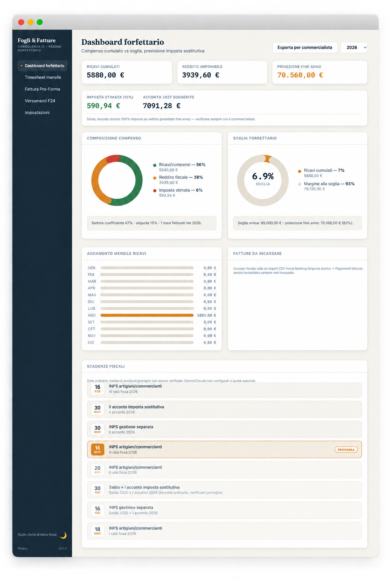
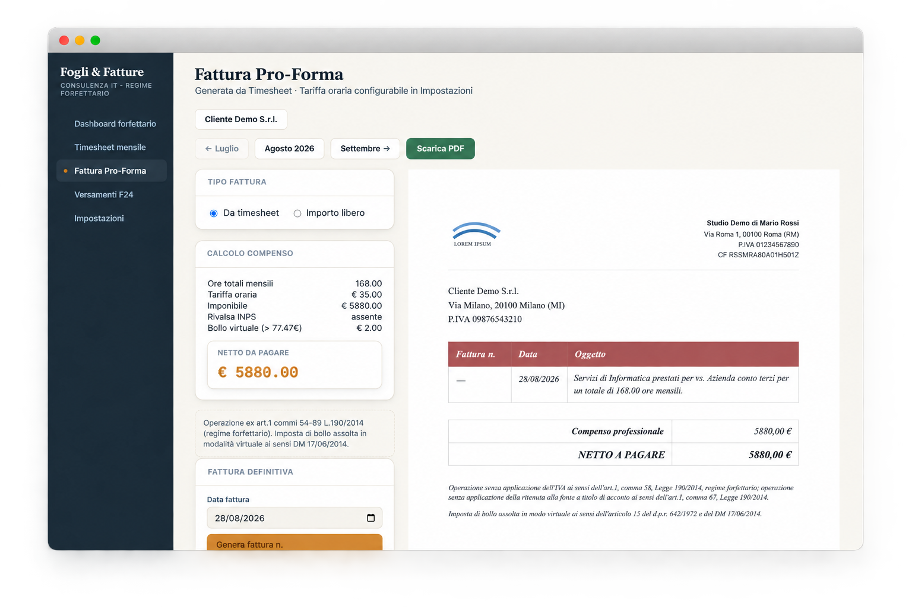
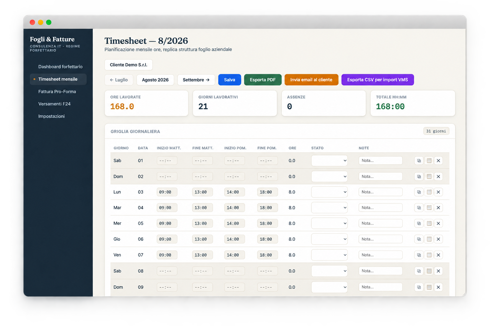

# Fogli & Fatture

[](LICENSE)
[](https://nodejs.org)

[](SECURITY.md)
[](CONTRIBUTING.md)

App per chi lavora in regime forfettario, con due funzioni indipendenti:
- **Timesheet mensile** — registra le ore lavorate giorno per giorno, per uno o più clienti.
- **Fatturazione elettronica** — genera fatture calcolate da timesheet (ore × tariffa) oppure a importo e descrizione liberi, senza bisogno del timesheet.

Gira sul tuo computer: nessun dato va su internet, nessun abbonamento.

**Stato del progetto**: attivo, mantenuto da una sola persona nel tempo libero — nessuno SLA. Segnalazioni prese sul serio, vedi [SECURITY.md](SECURITY.md).

## Indice

- [Features](#features)
- [Sicurezza](#sicurezza)
- [Screenshot](#screenshot)
- [Installazione](#installazione)
- [Primo utilizzo](#primo-utilizzo)
- [Domande frequenti](#domande-frequenti)
- [Note per chi programma](#note-per-chi-programma)
- [Licenza](#licenza)
- [Support Development](#support-development)

## Features

- **Timesheet multi-cliente** — ore giornaliere per cliente, con tariffa oraria propria per ciascuno.
- **Fatturazione elettronica FatturaPA** — XML conforme allo schema ufficiale, regime forfettario (`RegimeFiscale RF19`, IVA esente `N2.2`, bollo virtuale sopra soglia), validato prima dell'invio.
- **Invio PEC automatico** — fattura inviata al Sistema di Interscambio (SDI) direttamente dall'app, via la tua casella PEC.
- **Ricezione ricevute SDI automatica** — polling della casella PEC via IMAP, riconoscimento e archiviazione delle ricevute (accettazione, scarto, consegna, mancata consegna...), notifica desktop.
- **Fatturazione a importo libero** — anche senza passare dal timesheet, per fatture a corpo o extra.
- **Dashboard regime forfettario** — totali e soglie del regime aggiornati in tempo reale.
- **Numerazione fatture unica e progressiva** — condivisa correttamente tra tutti i clienti, come richiesto dalla normativa (legata alla partita IVA, non al singolo cliente).
- **Import storico** — importazione di timesheet pregressi (XLS) e fatture già emesse (XML FatturaPA), per partire senza perdere lo storico.
- **Backup automatico ed esportazione cifrata** — copia periodica programmabile, esportazione manuale protetta da password.
- **Promemoria fine mese** — notifica opzionale per non dimenticare di compilare il timesheet.
- **Scadenze fiscali con AI** — calcolo locale delle scadenze del regime forfettario, con supporto AI (Gemini) solo per casi particolari come le proroghe.
- **Login opzionale con Google OAuth** — accesso protetto per singolo utente, o app libera in rete locale se non configurato.
- **Multi-piattaforma** — installazione come servizio persistente su macOS (`launchd`) e Windows (Task Scheduler).

## Sicurezza

- Nessuna credenziale hardcoded: chiavi API, secret OAuth e dati PEC vivono solo in `backend/.env` locale, mai versionato né distribuito.
- La chiave API Gemini non viene mai esposta al frontend né scritta nei log — usata server-side solo per la chiamata a `generativelanguage.googleapis.com`.
- Avvio path-indipendente: l'app funziona da qualsiasi cartella, su Mac e Windows.
- Repository sotto scansione automatica continua: secret scanning (gitleaks), analisi statica del codice (CodeQL), controllo licenze delle dipendenze, controllo comportamento delle dipendenze (Socket.dev), monitoraggio CVE note (Dependabot).
- Dettagli completi e canale di segnalazione responsabile: [SECURITY.md](SECURITY.md).

**Trasparenza dati verso servizi AI esterni**: la funzione di lookup codice ATECO e il calcolo di alcune scadenze fiscali con proroga usano l'API Gemini (Google). Solo i dati strettamente necessari a quella specifica elaborazione (es. descrizione attività, date di scadenza) vengono inviati a Google — mai l'intero storico fatture/timesheet. La funzione è opzionale e disattivabile.

## Screenshot

### Tieni sotto controllo il regime forfettario

Ricavi cumulati, reddito imponibile, proiezione fine anno e distanza dalla soglia degli 85.000€: tutto in una sola schermata, aggiornato in tempo reale mentre fatturi. Scadenze fiscali comprese, con avviso per la prossima in arrivo.



### Dalle ore lavorate alla fattura, senza calcolatrice

Scegli il mese, l'app somma le ore dal timesheet e calcola il compenso in automatico — bollo virtuale incluso quando serve. Anteprima della fattura pronta a fianco, generazione definitiva con un click.



### Un foglio ore che conosci già

Compila le ore giorno per giorno, cliente per cliente, con la stessa logica di un foglio ore aziendale — nessuna curva di apprendimento. Più clienti attivi insieme, ognuno con la propria tariffa oraria.



<!-- TODO: altri screenshot in arrivo a scaglioni (wizard clienti, vista mobile/dark mode — vedi AI-Workspace/Plans/PUBBLICAZIONE_GITHUB_PUBLICO.md §2.4) -->

## Installazione

Serve solo la prima volta. Lo script fa tutto da solo: installa Node.js se manca, scarica le librerie necessarie, prepara la configurazione, avvia l'app come servizio permanente e apre il browser sulla pagina iniziale.

Requisiti minimi: Node.js ≥ 18 (installato automaticamente dallo script se assente), macOS o Windows 10/11.

### Mac

1. Apri l'app **Terminale** (Applicazioni → Utility → Terminale).
2. Scarica il progetto ed entra nella cartella:
   ```bash
   git clone https://github.com/priore/foglifatture.git
   cd foglifatture
   ```
3. Lancia l'installazione:
   ```bash
   scripts/install.sh
   ```

Da quel momento l'app:
- parte da sola ogni volta che accendi il Mac,
- si riavvia da sola se dovesse bloccarsi,
- resta sempre raggiungibile all'indirizzo `http://localhost:1969` (apri quel link con qualsiasi browser).

Per disinstallarla (ferma il servizio, **non tocca** i tuoi dati):
```bash
scripts/uninstall.sh
```

### Windows

1. Apri **PowerShell** (cerca "PowerShell" nel menu Start).
2. Scarica il progetto ed entra nella cartella:
   ```powershell
   git clone https://github.com/priore/foglifatture.git
   cd foglifatture
   ```
3. Lancia l'installazione:
   ```powershell
   .\scripts\install.ps1
   ```
   Se PowerShell blocca lo script ("esecuzione script disabilitata"), esegui prima una volta:
   ```powershell
   Set-ExecutionPolicy -Scope CurrentUser RemoteSigned
   ```

Da quel momento l'app:
- parte da sola ad ogni accesso a Windows,
- si riavvia da sola se dovesse bloccarsi,
- resta sempre raggiungibile all'indirizzo `http://localhost:1969` (apri quel link con qualsiasi browser).

Per disinstallarla (ferma il servizio, **non tocca** i tuoi dati):
```powershell
.\scripts\uninstall.ps1
```

## Primo utilizzo

1. Apri il browser su `http://localhost:1969`.
2. Vai su **Impostazioni** e compila la procedura guidata: i tuoi dati (partita IVA, ecc.), i dati del cliente (o dei clienti — puoi aggiungerne quanti ne servono, ognuno con la propria tariffa oraria), i dati PEC.
3. Da **Timesheet** registra le ore lavorate giorno per giorno. Se hai più clienti, scegli quale con il selettore in alto.
4. Da **Fattura Pro-Forma** genera la fattura del mese quando sei pronto (per il cliente scelto): scegli "Da timesheet" (calcolo automatico ore × tariffa) oppure "Importo libero" se vuoi fatturare un importo e una descrizione a piacere senza passare dal timesheet.

Tutto qui — non serve altro per iniziare a usarla.

## Domande frequenti

### Dove sono salvati i miei dati?

Nella cartella `backend/data/` del progetto, in semplici file. Non escono mai dal tuo computer. Fai un backup ogni tanto: in **Impostazioni** trovi la funzione "Esporta storico" che crea una copia cifrata con password, e puoi anche attivare un backup automatico periodico.

### Posso proteggere l'accesso con un login?

Sì, è facoltativo. Se non lo configuri, l'app è liberamente accessibile a chiunque abbia accesso al tuo computer/rete locale — va bene per uso personale su un solo Mac. Se vuoi il login con il tuo account Google:

1. Vai su [Google Cloud Console](https://console.cloud.google.com/) e crea delle credenziali "OAuth 2.0" (è una procedura di Google, gratuita, pensata anche per chi non è sviluppatore — cerca "Credenziali" nel menu).
2. Come "Redirect URI" indica: `http://localhost:1969/auth/google/callback`.
3. Apri il file `backend/.env` con un editor di testo qualsiasi (es. TextEdit) e incolla i due codici che Google ti dà (`GOOGLE_CLIENT_ID` e `GOOGLE_CLIENT_SECRET`), più la tua email in `ALLOWED_EMAIL`.
4. Riavvia l'app (`scripts/uninstall.sh` seguito da `scripts/install.sh`, oppure su Windows `.\scripts\uninstall.ps1` seguito da `.\scripts\install.ps1`): da ora solo quella email potrà entrare.

### Posso fatturare a più clienti?

Sì. In Impostazioni → Clienti puoi aggiungerne quanti ne servono, ognuno con la propria anagrafica e tariffa oraria. Il timesheet e la fattura di ogni mese sono separati per cliente. La numerazione delle fatture resta però unica e progressiva su tutti i clienti insieme (è un obbligo di legge legato alla tua partita IVA, non al cliente).

### Come invio le fatture?

Dalla schermata della fattura puoi inviarla via PEC direttamente, se in Impostazioni hai inserito i dati della tua casella PEC (indirizzo, password, server del tuo gestore). Se qualcosa non va nell'invio, il file `backend/logs/pec.log` registra ogni tentativo — è il primo posto da controllare.

### Qualcosa non funziona, dove guardo?

- `logs/error.log` — errori generali del programma.
- `backend/logs/app.log` — registro dettagliato di ogni operazione.
- `backend/logs/pec.log` — solo per problemi di invio PEC.

Se vuoi ricontrollare che l'app sia davvero attiva:
```bash
launchctl list | grep com.prioregroup.fatturazione   # Mac
```
```powershell
Get-ScheduledTask -TaskName PrioreGroupFatturazione   # Windows
```

### L'app sostituisce il mio commercialista?

**No. FogliFatture è uno strumento di supporto operativo per la gestione di timesheet e fatturazione elettronica: non sostituisce la consulenza di un commercialista o consulente fiscale.** La correttezza dei dati fiscali inviati e conservati resta responsabilità di chi usa l'app.

## Note per chi programma

- `backend/` — API Express, generatore/validatore XML FatturaPA, invio PEC, storage su file JSON, login Google OAuth opzionale.
- `frontend/` — SPA Vue 3 (Composition API, `<script setup>`).

Avvio in modalità sviluppo (senza installarlo come servizio):

```bash
cd backend
npm install
cp .env.example .env
npm start               # http://localhost:1969
```

```bash
cd frontend
npm install
npm run build            # oppure: npm run dev (hot-reload su :5173, proxy verso il backend)
```

Test:
```bash
cd backend
npm test
```

Vuoi contribuire? Leggi [CONTRIBUTING.md](CONTRIBUTING.md) e il [Codice di Condotta](CODE_OF_CONDUCT.md).

## Licenza

Distribuito sotto [PolyForm Noncommercial 1.0.0](LICENSE). Uso libero per scopi non commerciali (visione, uso, modifica). Qualsiasi uso commerciale — inclusi rivendita e offerta come servizio SaaS — richiede un accordo preventivo separato con l'autore: contatta [@priore](https://github.com/priore) su GitHub.

***Nessuna garanzia***: il software è fornito così com'è, senza garanzie esplicite o implicite. Vedi [LICENSE](LICENSE) e [SECURITY.md](SECURITY.md).

## Support Development

Se questo progetto ti è stato utile, considera una piccola donazione. Ogni contributo aiuta a finanziare nuove funzionalità e mantenere il progetto attivo.

Scansiona il codice qui sotto con il tuo wallet, oppure copia l'indirizzo. In alternativa puoi donare via PayPal.

|Donate with BTC (Bitcoin)|
|:------------:|
||
|`BTC Address (SegWit) : bc1q6rjOuuwu9k2fvs5n5elmqy9v4ljazhexejykjm`|

[](https://paypal.me/prioregroup)
